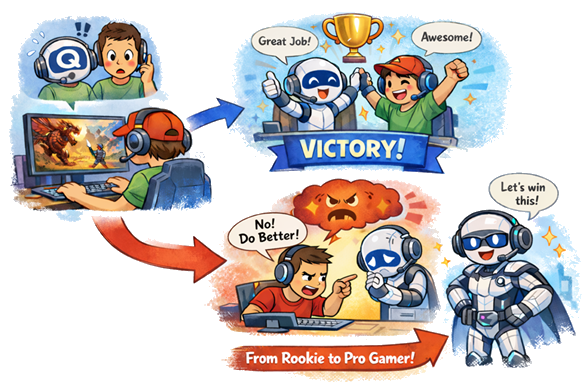

# 🧇📡 WAFFLE-FI  
*Reinforcement Learning 기반 커버리지 탐색 및 실내 Wi-Fi 자동 분석 시스템*  

---
## 🌐 프로젝트 개요

> ❓ **“건물 안에 Wi-Fi 안 터지는 곳이 있던데요?”**

WAFFLE-FI는 **강화학습 기반 커버리지 탐색 로봇**을 이용해 **실내 Wi-Fi 신호(RSSI)를 자동으로 측정**하고, **히트맵 형태로 시각화**하는 AI Wi-Fi 유지보수 시스템입니다

- **강화학습(RL)** 기반 커버리지 최적화
- Wi-Fi **음영 지역 자동 탐색**
- **RSSI 기반** 신호 세기 측정
- **Qt GUI** 기반 Wi-Fi 히트맵 시각화
- **ROS2** 기반 모듈형 아키텍처

---
## 🏗️ 프로젝트 아키텍처
  

### 🔧 Hardware & Sensor

- ESP32 Wi-Fi Scan
- Linux Device Driver

### 🧠 System Call & Data

-  ROS2
-  Reinforcement Learning
-  DB (SQLite)

### 🖥️ User Interface

- Qt GUI (Heatmap / Simulation)

---
## ⭐ 핵심 기능
| 목표              | 설명                    |
| --------------- | --------------------- |
| RL 커버리지 탐색      | 강화학습을 통해 공간을 효율적으로 탐색 |
| Wi-Fi AP 신호 측정  | ESP32 기반 RSSI 수집      |
| Maintenance GUI | Qt 기반 히트맵 시각화 및 관리 UI |

---
## ⚙️ 주요 기능 상세
### 🤖 Reinforcement Learning

**강화학습 개념**
- Q 라는 이름의 로봇에게 매 선택 시 조언 → 좋은 결과가 나오면 보상, 나쁜 결과가 나오면 벌점을 부여하여 학습

**주요 용어**
- Q : 각 행동의 누적 보상 기대값 (점수)
- Epsilon : 탐험 비율 파라미터 (0.0 ~ 1.0)
- Replay Buffer : 연속된 행동은 강한 상관 관계를 가지기 때문에 버퍼에서 랜덤하게 샘플링해서 학습

**주요 학습 알고리즘**
- DQN : DNN + Q Learning
- DDQN (Double DQN) : 선택 network와 평가 network를 분리하여 과대추정(overestimation) 방지
- PER (Prioritized Experience Replay) : Replay Buffer에서 중요한 경험에 우선순위
- PPO (Proximal Policy Optimization) : Policy-Based / Q-Learning 계열이 행동을 학습하고 이산적인 행동을 가지는 것에 대비하여 정책을 학습하고 연속적인 행동 공간을 가짐

**강화학습 기반 커버리지 탐색**  
-	새로운 공간 탐색 시 보상 증가  
-	제자리 회전, 충돌에 페널티 부여  
-	DQN / DDQN 개념을 적용한 정책 학습  
  
  > 📈 **Training Results**
  - EP 1 ~ 50
    - Avg Reward: 13.67
    - Turn Ratio: 0.7 ± 0.1
  - EP 1001 ~ 1050
    - Avg Reward: 51.89
    - Turn Ratio: 0.4 ± 0.1
  - EP 3001 ~ 3050
    - Avg Reward: 144.57
    - Avg New Cell: 73.36
    - Turn Ratio: 0.3 ± 0.1

---
### 🔌Wi-Fi RSSI (ESP32)
  

**주변 Wi-Fi AP 스캔 및 RSSI 측정**   
  - Wi-Fi Scan → SSID / RSSI → UART 전송  

---
### 🧩 ROS2 Node Structure

**로봇 주행, 센서 데이터 통합**  
- Turtlebot3 제어
- Wi-Fi RSSI Node / Grid Pose Node / Fusion Node 구성
- QoS 설정을 통한 통신 안정성 확보

| Node                | 역할               |
| ------------------- | ---------------- |
| Wi-Fi RSSI Node     | SSID / RSSI 수집   |
| RL / Grid Pose Node | 강화학습 정책 실행       |
| Fusion Node         | RSSI + 위치 데이터 결합 |
| Turtlebot3 Node     | 로봇 제어            |
| Qt Visualizer Node  | 히트맵 계산 및 시각화     |
| DB Node             | 데이터 저장 및 쿼리      |

---
### 🖥️ Qt GUI

**사용자 인터페이스 및 히트맵 시각화**  
- 세션 기반 데이터 관리
- SSID 선택 및 ALL 모드 지원
- 실시간 / 저장 데이터 히트맵 렌더링

---
## 🛠️ Troubleshooting
- **Wi-Fi 스캔 지연** → 불필요한 채널 스캔 제거 및 필요 채널만 선택 → **스캔 시간 1.8s → 0.5s로 단축**
- **강화학습 중 잦은 충돌 및 제자리 회전** → 행동 공간 확장(4→6)과 충돌·회전 페널티 강화 → **이동 안정성 및 탐색 효율 향상**
- **ROS 토픽 메시지 손실** → 데이터 특성에 맞게 QoS 정책 통일 → **통신 안정성 확보 및 메시지 손실 해소**
- **지도 회전 후 위치·히트맵 오류** → 좌표계 회전 제거, View 레이어만 회전 → **좌표계 일관성 유지 및 시각화 정상화**

---
## 📋 담당 업무
| 이름 | 담당 |
|------|------|
| **문두르** | Project Lead / Reinforcement Learning |
| **김*현** | Project Management / Qt GUI |
| **나*훈** | ROS2 / Database |
| **조*재** | ESP32 Firmware / Device Driver |
